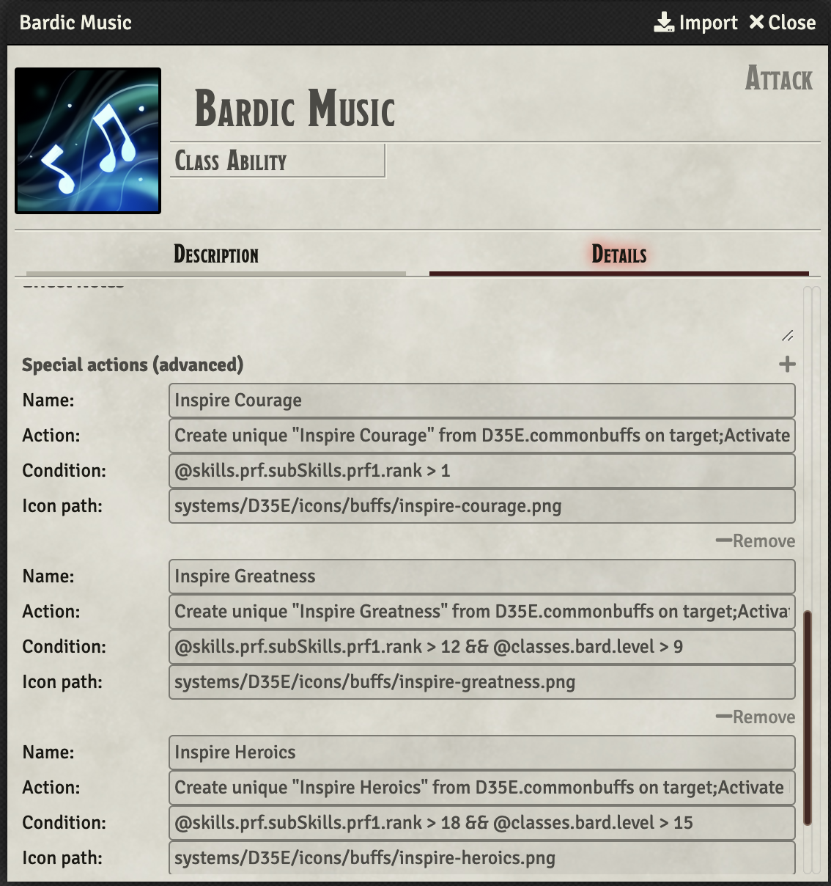

# Special Actions System
## About
Special Actions system is a system for adding special, 
usable actions for items. It allows for building complex items 
or abilities that add items to actors, set item charges, activate buffs,
cast spells. 

## Basics
Each item that has an Action can use Special Actions. If you don't want to 
execute anything beyond those special actions, you can use new action type "Special".

To add special actions use `+` button located near section title, to remove action use `- Remove action` button. 

## Creating special action
To create special actions you need to fill at least `Name` and `Action` fields in action block.
While `Name` field can be anything you want, `Action`

